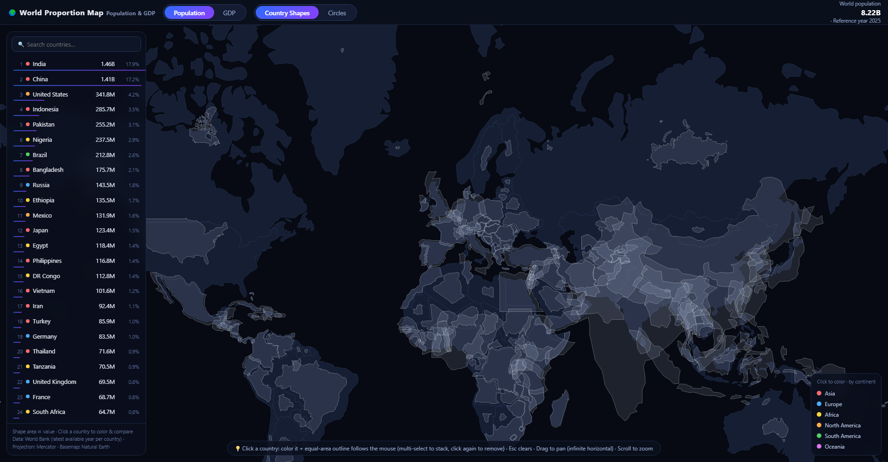

# 🌍 World Proportion Map — Population & GDP

An interactive, thetruesize-style world map where **every country keeps its real border shape, but its area is rescaled to be proportional to its population or GDP**. Compare countries by equal-area replacement instead of circles.



## Live

- GitHub Pages: https://fuge0xsol.github.io/world-proportion-map/
- Cloudflare Pages: https://world-proportion-map.pages.dev/

## Features

- **Country shapes, not circles** — each country's outline is scaled around its centroid so its screen area is exactly proportional to the selected metric (non-contiguous cartogram). A "Circles" toggle is available.
- **True Area mode** — the thetruesize signature: switch to *True Area* and outlines render at their real geographic size (no distortion compensation for Mercator); pick a country and drag its true-size outline anywhere on the map to compare. The ranking switches to real land area (km²).
- **Neutral by default, color on click** — the map stays monochrome; click any country (on the map or in the ranking) to color it by continent and stack multiple selections for comparison, thetruesize-style.
- **Equal-area compare ghost** — after selecting a country, a dashed equal-area outline follows your mouse so you can measure it against any region.
- **Infinite horizontal pan** — Mercator world tiled three ways with wrap-around dragging; scroll to zoom, double-click to zoom in.
- **Ranking panel** — all 200+ economies sorted by the current metric with share bars, plus search.
- **Tooltips** — value, reference year, share of world, rank, and GDP per capita.

## Data

- Source: [World Bank Open Data](https://data.worldbank.org/) — `SP.POP.TOTL` (Population, total) and `NY.GDP.MKTP.CD` (GDP, current US$), latest available year per economy (2025 reference year at build time).
- Taiwan is added manually (not covered by the World Bank).
- Country metadata (English names, ISO codes, continents): [world-countries](https://www.npmjs.com/package/world-countries).
- Basemap geometry: [world-atlas](https://github.com/topojson/world-atlas) 110m (Natural Earth), rendered with [d3-geo](https://github.com/d3/d3-geo).

Everything (data + libraries) is embedded — the page is a single self-contained `index.html` (~440 KB) that works offline via `file://`.

## Build

```bash
node build.js   # merges raw/ data + src/ template into index.html
```

- URL params: `#gdp` opens in GDP mode, `?circle=1` switches to circle view, `?static=1` disables entry animation (also respects `prefers-reduced-motion`).
